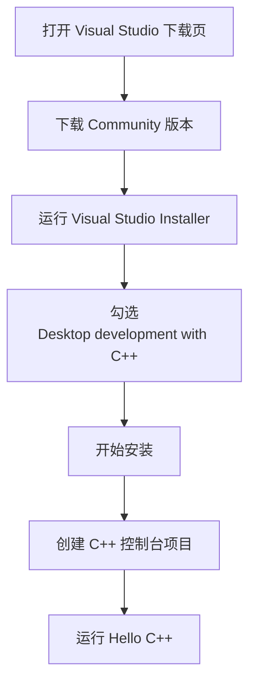
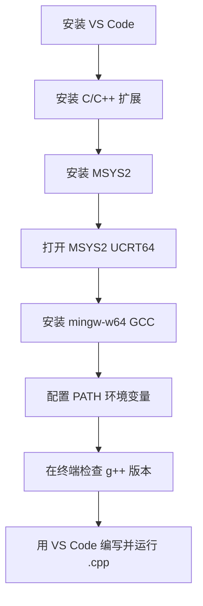
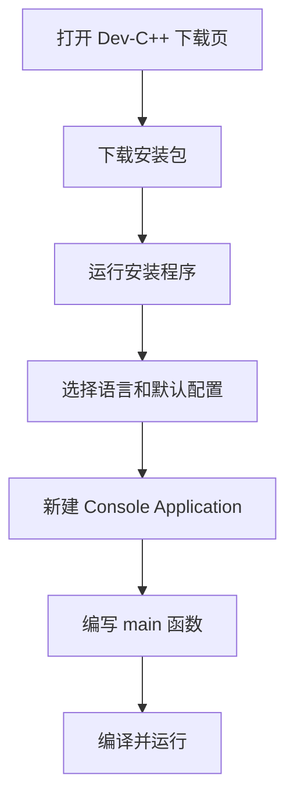
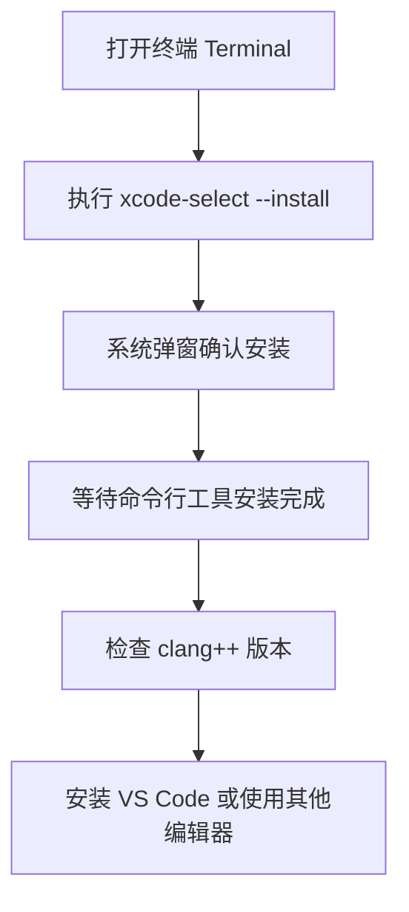
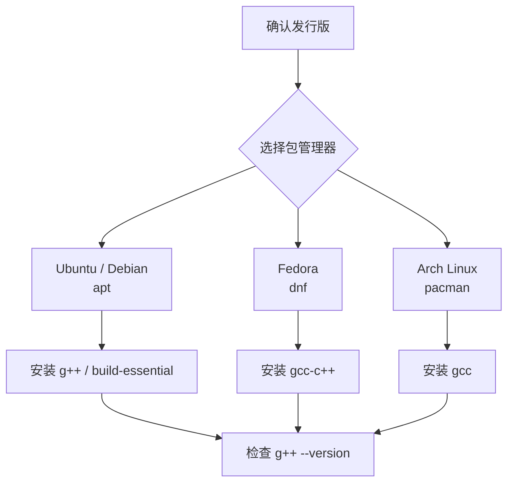
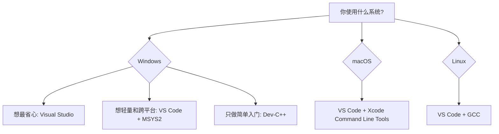

# 开发环境安装

上一篇先认识了 C++ 的定位和程序从源码到可执行文件的大致过程。这一篇开始把环境真正装起来：选择编译器、选择编程软件，并在不同操作系统上完成最小可用配置。

初学 C++ 时，建议先把目标定得简单一点：能写一个 `.cpp` 文件，能编译，能运行，能看到输出结果。复杂的项目构建、调试配置和工程模板可以后面再逐步补上。

## 先理解工具分工

C++ 开发环境通常由两类工具组成：

- 编译器：负责把 C++ 源码编译成可执行程序，例如 MSVC、GCC、Clang。
- 编程软件：负责写代码、管理文件、运行或调试程序，例如 Visual Studio、VS Code、Dev-C++。

有些软件会把这些能力打包在一起，例如 Visual Studio 和 Dev-C++；有些软件只是编辑器，需要你另外安装编译器，例如 VS Code。


## 下载地址速查

下面尽量使用官方或项目主页链接。下载软件时优先从这些入口进入，少从来路不明的网盘或第三方下载站获取安装包。

| 工具 | 适用系统 | 作用 | 下载地址 |
| --- | --- | --- | --- |
| Visual Studio Community | Windows | 完整 IDE，内置 MSVC 工具链 | [Visual Studio 下载页](https://visualstudio.microsoft.com/downloads/) |
| Visual Studio Code | Windows / macOS / Linux | 轻量编辑器，需要配合编译器 | [VS Code 下载页](https://code.visualstudio.com/download) |
| MSYS2 | Windows | 安装 GCC / MinGW-w64 工具链 | [MSYS2 官网](https://www.msys2.org/) |
| MinGW-w64 | Windows | Windows 下的 GCC 工具链基础项目 | [MinGW-w64 官网](https://www.mingw-w64.org/) |
| Dev-C++ | Windows | 轻量 C/C++ IDE，适合快速入门 | [Embarcadero Dev-C++](https://www.embarcadero.com/free-tools/dev-cpp) |
| Xcode Command Line Tools | macOS | 提供 Apple Clang 等命令行工具 | [Apple 安装说明](https://developer.apple.com/documentation/xcode/installing-the-command-line-tools/) |
| GCC | Linux / macOS / Windows | 常用开源编译器集合 | [GCC 官网](https://gcc.gnu.org/) |
| LLVM / Clang | Linux / macOS / Windows | 常用现代编译器工具链 | [LLVM Releases](https://releases.llvm.org/) |

## Windows 环境

Windows 上有三种常见选择。初学如果想少折腾，优先选 Visual Studio；如果想贴近命令行和跨平台开发，选 VS Code + MSYS2；如果只是课堂练习或老电脑轻量使用，可以选 Dev-C++。

### 方案一：Visual Studio Community

Visual Studio 是 Windows 上最省心的 C++ IDE 之一，适合想要一站式安装、编译、运行、调试的读者。



安装时最关键的一步，是在工作负载中勾选 **Desktop development with C++**。这个选项会安装 MSVC 编译器、Windows SDK、调试器等 C++ 开发需要的核心组件。

适合人群：

- 希望安装完成后就能创建项目、运行和调试。
- 使用 Windows 作为主要开发环境。
- 后续可能学习 Windows 桌面程序、游戏开发或大型 C++ 项目。

### 方案二：VS Code + MSYS2 / MinGW-w64

VS Code 本身不是编译器，它更像一个轻量代码编辑器。要写 C++，需要另外安装 GCC 或 Clang。Windows 下比较推荐通过 MSYS2 安装 MinGW-w64 工具链。



常见安装顺序：

1. 从 [VS Code 下载页](https://code.visualstudio.com/download) 安装 VS Code。
2. 在 VS Code 扩展市场安装 Microsoft 的 C/C++ 扩展。
3. 从 [MSYS2 官网](https://www.msys2.org/) 安装 MSYS2。
4. 打开开始菜单中的 **MSYS2 UCRT64**。
5. 安装 GCC 工具链：

```bash
pacman -S mingw-w64-ucrt-x86_64-gcc
```

6. 把 MSYS2 的 UCRT64 `bin` 目录加入系统 PATH，例如：

```text
C:\msys64\ucrt64\bin
```

7. 重新打开终端，检查编译器是否可用：

```bash
g++ --version
```

如果能看到版本信息，说明编译器已经可以被系统找到。

适合人群：

- 想使用轻量编辑器。
- 后续希望接触命令行、Make、CMake 等工程工具。
- 想让 Windows 开发体验更接近 Linux / macOS。

### 方案三：Dev-C++

Dev-C++ 是 Windows 上比较轻量的 C/C++ IDE，安装后通常可以直接创建、编译和运行控制台程序。它适合做入门练习，但不太建议作为长期工程开发的主力工具。



选择 Dev-C++ 时要注意两点：

- 尽量选择维护较新的版本，例如 Embarcadero Dev-C++。
- 如果后续学习现代 C++、大型项目或跨平台工程，建议逐步转向 VS Code 或 Visual Studio。

## macOS 环境

macOS 上最常见的 C++ 编译器是 Apple Clang。你不一定需要安装完整 Xcode，初学阶段安装 Xcode Command Line Tools 通常就够了。



在终端中执行：

```bash
xcode-select --install
```

安装完成后检查：

```bash
clang++ --version
```

如果能看到版本信息，就说明基本编译环境已经准备好。

编程软件推荐：

- VS Code：轻量、跨平台，适合学习和日常练习。
- Xcode：适合后续做 Apple 平台开发，但对纯 C++ 入门来说体量偏大。
- CLion：功能完整的跨平台 C/C++ IDE，但不是免费工具。

如果后续需要安装更新版本的 GCC 或 LLVM，也可以使用 Homebrew 管理工具链。初学阶段先用系统提供的 Apple Clang 即可。

## Linux 环境

Linux 上通常直接通过系统包管理器安装编译器。不同发行版命令不同，但思路一致：安装 GCC 或 Clang，再选择一个编辑器。



Ubuntu / Debian：

```bash
sudo apt update
sudo apt install build-essential
g++ --version
```

Fedora：

```bash
sudo dnf install gcc-c++
g++ --version
```

Arch Linux：

```bash
sudo pacman -S gcc
g++ --version
```

编程软件推荐：

- VS Code：适合大多数学习和轻量项目。
- Vim / Neovim：适合喜欢终端工作流的用户。
- CLion：适合大型 C++ 工程，但需要付费或符合免费授权条件。
- Qt Creator：如果后续学习 Qt 桌面开发，可以考虑。

Linux 下的优势是编译器和命令行工具天然比较完整，适合尽早理解“编辑、编译、运行”的完整过程。

## 编程软件怎么选

如果不知道怎么选，可以按下面这个路线来：



整体建议：

- Windows 初学首选 Visual Studio，想练命令行再选 VS Code + MSYS2。
- macOS 初学使用 Xcode Command Line Tools + VS Code。
- Linux 初学使用 GCC + VS Code。
- Dev-C++ 可以作为轻量入门工具，但不要把它当成长期工程实践的唯一工具。

## 安装完成后如何验证

不管使用哪个系统，最终都要验证两件事：编程软件能打开代码文件，终端或 IDE 能找到 C++ 编译器。

可以先检查编译器版本：

```bash
g++ --version
```

或：

```bash
clang++ --version
```

如果使用 Visual Studio，则可以在 Visual Studio Installer 中确认已经安装 **Desktop development with C++**，并在 Visual Studio 中创建一个 C++ 控制台项目测试。

最小验证流程如下：


## 常见问题

### 安装了 VS Code，为什么还是不能运行 C++？

因为 VS Code 只是编辑器，不自带 C++ 编译器。你还需要安装 MSVC、GCC 或 Clang，并确保系统能找到对应命令。

### Windows 上到底选 Visual Studio 还是 VS Code？

如果你只想尽快写出并运行程序，选 Visual Studio。它更重，但配置少。如果你想学习更通用的命令行开发方式，选 VS Code + MSYS2。

### Dev-C++ 还能用吗？

可以用于简单入门和课堂练习，但它不太适合作为长期工程开发工具。后续学习现代 C++、CMake、调试和多文件项目时，VS Code 或 Visual Studio 会更合适。

### macOS 上需要安装完整 Xcode 吗？

不一定。只学习 C++ 基础时，Xcode Command Line Tools 通常够用。只有当你要做 Apple 平台应用开发，或者需要 Xcode 的图形化项目管理能力时，再安装完整 Xcode。
