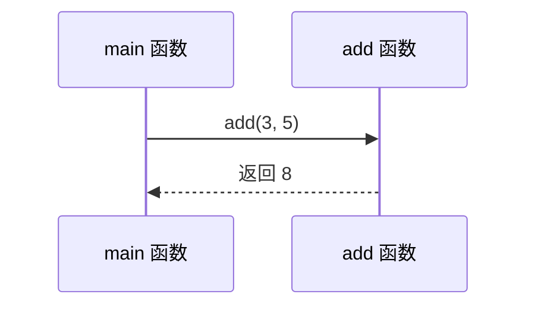

# 函数与模块化

## 这一节你会学到什么

- 函数是什么，为什么要把代码拆成函数
- 参数、返回值、声明和定义
- 变量作用域
- 如何用函数让程序更容易维护

## 它是什么？

函数是一段有名字、可以重复调用的代码。它像一个小工具：给它输入，它完成一件事，然后可能返回一个结果。

## 为什么需要它？

如果同样的计算要写很多遍，代码会越来越难改。函数可以把“计算总价”“判断是否及格”“打印菜单”这类动作封装起来，让主流程更清楚。

## 基础用法

```cpp
#include <iostream>
using namespace std;

int add(int a, int b) {
    return a + b;
}

int main() {
    int result = add(3, 5);
    cout << result << endl;
    return 0;
}
```

这段代码中，`add` 是函数名，`int a` 和 `int b` 是参数，前面的 `int` 表示返回值类型。

## 函数调用过程



可以把函数调用理解成“临时派人去办一件事”。事情办完后，结果交回调用方。

## 声明与定义

当函数写在 `main` 后面时，需要先声明。

```cpp
#include <iostream>
using namespace std;

int add(int a, int b);

int main() {
    cout << add(2, 6) << endl;
    return 0;
}

int add(int a, int b) {
    return a + b;
}
```

声明告诉编译器“后面会有这个函数”，定义才是函数真正做什么。

## 没有返回值的函数

```cpp
#include <iostream>
using namespace std;

void printWelcome() {
    cout << "欢迎学习 C++" << endl;
}

int main() {
    printWelcome();
    return 0;
}
```

`void` 表示这个函数不返回结果。

## 作用域

变量只在它所在的代码块里有效。

```cpp
#include <iostream>
using namespace std;

int main() {
    int outer = 10;

    if (outer > 0) {
        int inner = 20;
        cout << inner << endl;
    }

    cout << outer << endl;
    return 0;
}
```

`inner` 只在 `if` 的花括号里可用，离开后就不能访问。

## 常见错误

### 返回值类型不匹配

```cpp
int getName() {
    return "Ada"; // 错误：字符串不能当 int 返回
}
```

函数声明的返回类型要和真正返回的值一致。

### 忘记返回值

```cpp
int add(int a, int b) {
    int result = a + b;
}
```

返回值类型不是 `void` 的函数，通常必须 `return` 一个结果。

## 小练习

### 练习 1

写一个 `square` 函数，接收整数并返回平方。

### 练习 2

写一个 `isAdult` 函数，接收年龄并返回 `bool`。

### 练习 3

把一个菜单程序拆成 `printMenu` 和 `handleOption` 两个函数。

## 本节小结

- 函数让代码可以复用，也让主流程更清楚。
- 参数是输入，返回值是输出。
- 声明解决“先使用还是先定义”的顺序问题。
