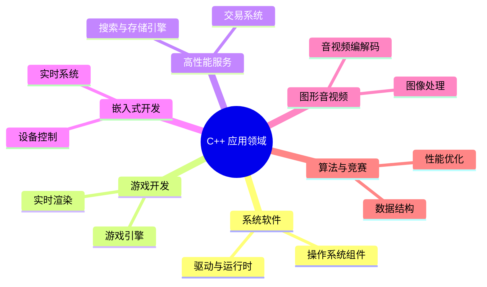
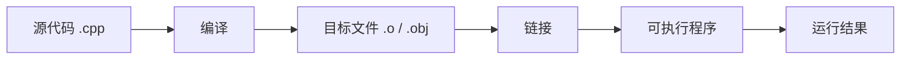

# 起步认识 C++

C++ 是一门很适合长期学习的语言。它既能贴近计算机底层，又能提供面向对象、泛型编程、标准库等更高层次的抽象。学习 C++ 的第一步，不是立刻记住所有语法，而是先建立几个基本认知：C++ 用来解决什么问题，一个程序大致怎样从源码变成可运行程序，以及后续应该按什么顺序学习。

这篇文章只做入门铺垫，不讲开发环境安装，也不展开复杂语法。编译器安装、编辑器配置、命令行编译与运行会放到下一篇文章中单独说明。

## 这篇文章解决什么问题

很多人第一次接触 C++ 时，会同时被几个问题包围：

- C++ 和 C 语言是什么关系？
- 为什么 C++ 常常和性能、底层、游戏、系统开发联系在一起？
- 源代码为什么不能直接运行？
- 编译器、标准库、头文件这些词分别是什么意思？
- 学 C++ 应该从哪里开始，后面又会学到什么？

本篇的目标就是先把这些问题串起来。读完之后，你不一定已经能写复杂程序，但应该能看懂 C++ 学习路线的全貌，也知道下一步为什么要先准备开发环境。

## C++ 是什么

C++ 可以理解为一门“既能向下控制细节，也能向上组织抽象”的编程语言。

它继承了 C 语言贴近硬件、运行效率高、可直接管理内存等特点，同时又增加了类、对象、模板、异常、标准库等能力。也就是说，C++ 既可以写很接近底层的代码，也可以用更工程化的方式组织大型程序。

这种特点让 C++ 的学习曲线比一些脚本语言更陡，但它也带来一个重要优势：你会更清楚程序和计算机之间发生了什么。变量如何存储，函数如何调用，资源何时创建和释放，代码如何被编译成机器能执行的程序，这些问题在 C++ 中都绕不开。

## C++ 适合用来做什么

C++ 常见于对性能、资源控制或系统能力要求较高的场景。



这并不意味着所有项目都应该使用 C++。如果只是写一个简单脚本，Python 可能更合适；如果是快速开发 Web 页面，JavaScript 或 TypeScript 更直接。C++ 的优势通常出现在这些地方：程序需要跑得快、资源需要精细控制、系统边界比较靠底层、代码规模和生命周期比较长。

## C++ 程序大致是怎么运行的

写 C++ 时，我们保存下来的通常是源代码文件，例如 `.cpp` 文件。源代码本身只是文本，计算机不能直接把它当成程序运行。它需要先经过编译器处理，再通过链接器把相关代码组合起来，最后生成可执行程序。



<CppCompileFlow />

可以先把这个过程理解成一条生产线：

- 源代码是你写下来的程序文本。
- 编译会检查语法，并把源码翻译成更接近机器的形式。
- 目标文件是编译后的中间产物。
- 链接会把你自己的代码、标准库代码和其他依赖组合起来。
- 可执行程序才是操作系统能够启动运行的文件。

下一篇讲开发环境时，我们会真正安装编译器，并让这个流程在本地跑起来。

## 第一个 C++ 程序长什么样

一个最小的 C++ 程序通常会长这样：

```cpp
#include <iostream>

int main() {
    std::cout << "Hello, C++!" << std::endl;
    return 0;
}
```

现在不用急着记住每个符号的细节，只需要先看出它由几部分组成：

- `#include <iostream>` 引入标准库中的输入输出能力。
- `int main()` 是程序入口，程序通常从这里开始执行。
- `std::cout` 用来向屏幕输出内容。
- `return 0` 表示程序正常结束。

后面的文章会逐步解释这些写法。第一篇只需要建立一个印象：C++ 程序有固定的入口，也需要借助标准库完成常见任务。

## 学 C++ 前需要知道的几个关键词

在继续学习之前，可以先认识几个经常出现的词。现在只需要知道它们大概指什么，不需要一次性掌握全部细节。

### 编译器

编译器负责把 C++ 源代码翻译成目标文件或可执行程序。常见的 C++ 编译器有 GCC、Clang 和 MSVC。

### 标准库

标准库是 C++ 自带的一组常用能力，例如输入输出、字符串、容器、算法、时间处理等。学 C++ 不只是学语法，也要学会使用标准库。

### 源文件

源文件通常以 `.cpp` 结尾，里面放具体的 C++ 代码实现。

### 头文件

头文件通常以 `.h`、`.hpp` 等结尾，常用于声明函数、类、常量或模板。大型 C++ 项目经常会把声明和实现拆到不同文件中。

### 可执行文件

可执行文件是编译和链接之后得到的程序。它可以被操作系统启动运行。

### C++ 标准

C++ 会持续演进，不同年份发布过不同标准，例如 C++11、C++17、C++20、C++23。标准决定了语言支持哪些语法和库能力。初学阶段不用纠结所有差异，但应该知道“现代 C++”通常指 C++11 之后逐渐形成的一套更安全、更清晰的写法。

## C++ 学习路线概览

这套 C++ 文档会按“先能运行，再能组织，再能工程化”的顺序推进。

1. 开发环境：安装编译器和编辑器，运行第一个程序。
2. 基础语法：学习变量、类型、表达式和基本输入输出。
3. 控制流：使用条件、循环和简单程序逻辑。
4. 函数：把重复逻辑拆成可复用的单元。
5. 指针、引用与内存：理解 C++ 中最重要也最容易出错的部分。
6. 类与对象：学习如何组织数据和行为。
7. 继承与多态：理解面向对象中的扩展和动态行为。
8. 模板与 STL：使用泛型能力和标准容器、算法。
9. 输入输出、文件与异常：处理文件、错误和程序边界情况。
10. 现代 C++：学习智能指针、移动语义、Lambda 等现代写法。
11. 并发编程：理解线程、同步和并发任务。
12. 数据结构与算法实践：把语言能力用于解决典型问题。
13. 工程实践：学习项目组织、构建、调试、测试和代码规范。

这条路线不要求一口气学完。更合适的方式是：每学一个主题，就写几个小程序，遇到报错时认真读信息，逐步把概念和实践连起来。
